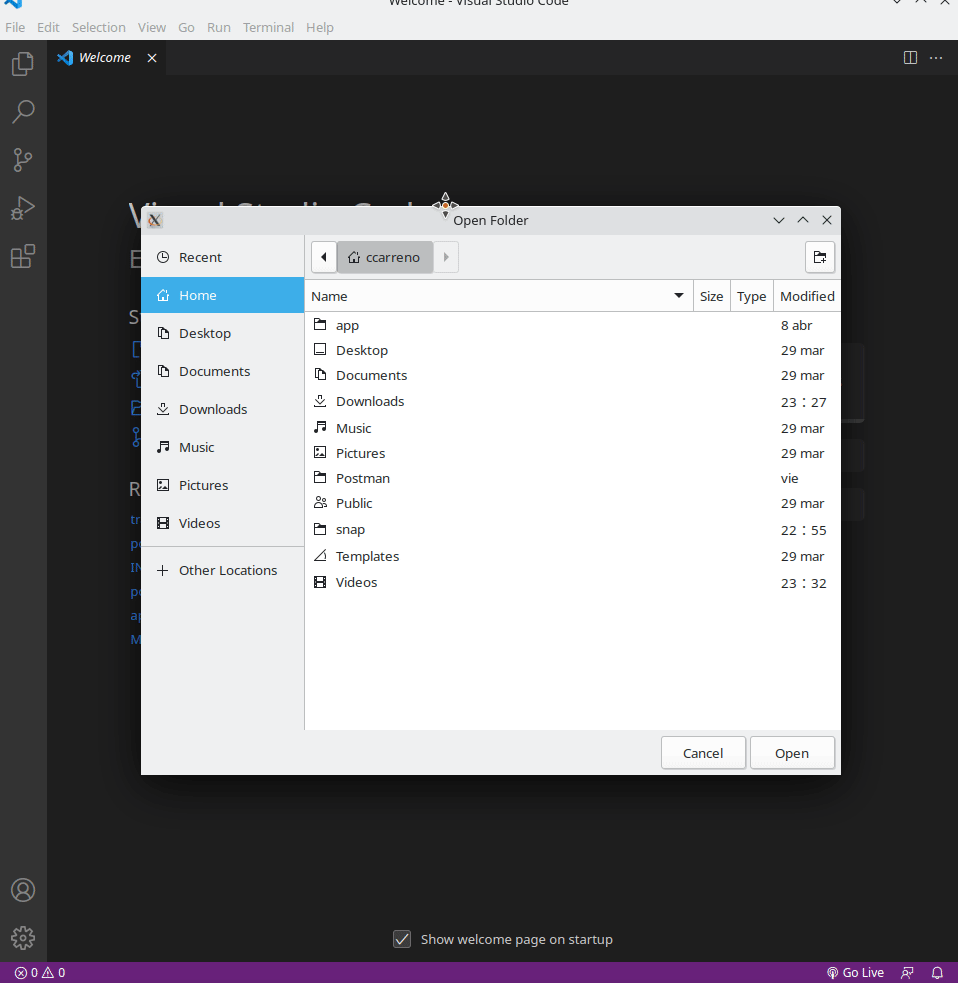
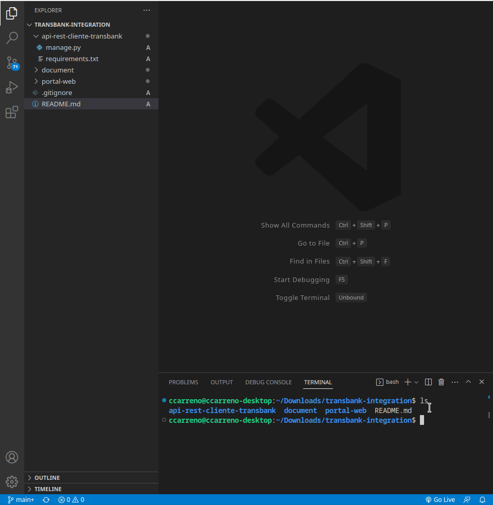
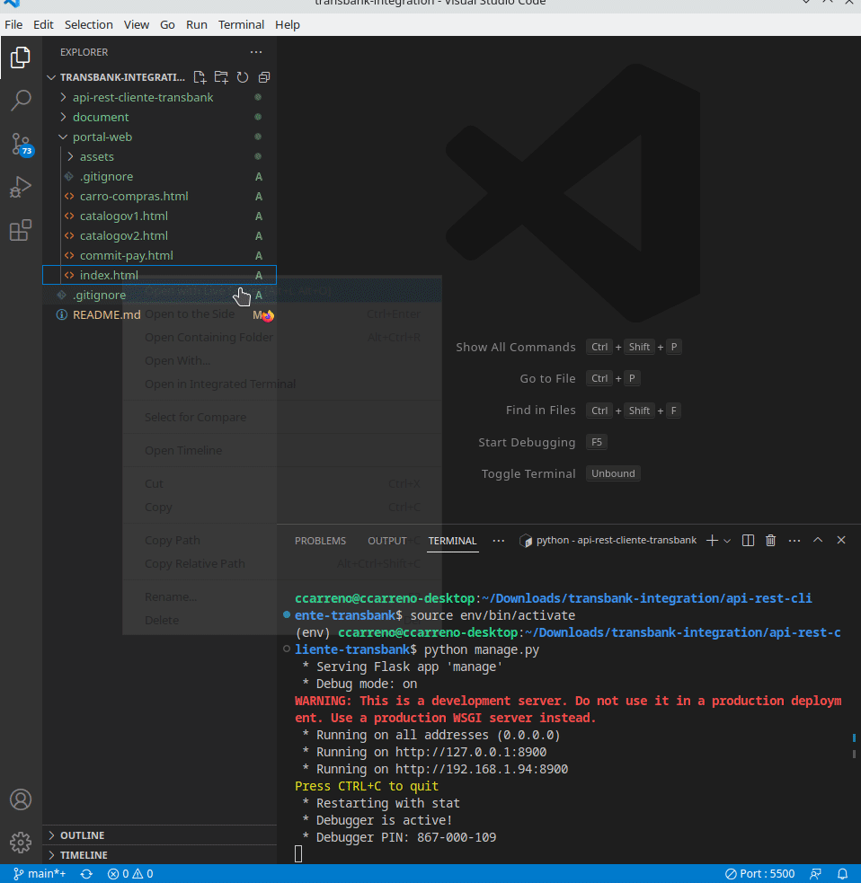
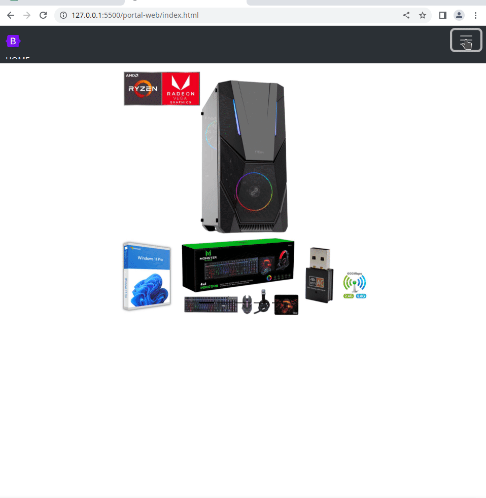
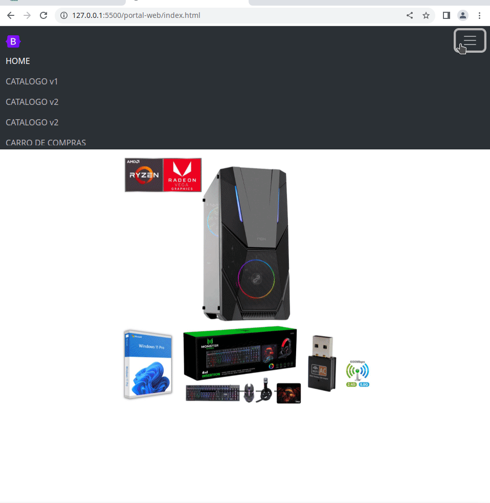

# INTEGRACIÓN TRANSBANK FRONTEND (HTML + JAVASCRIPT) Y BACKEND DE INTEGRACIÓN CON TRANSBANK (API REST FLASK)


### COMIENZO DEL DESPLIEGUE

El primer paso es abrir el directorio del proyecto **transbank-integration** en vscode y una terminal.



### BACKEND -> API REST FLASK DESPLIEGUE EN LINUX. 

Para desplegar en linux o en windows deberemos crear un entorno virtual de python, instalar las librerias para posteriormente ejecutar el servidor.



### FRONTEND -> HTML + JAVASCRIPT DESPLIEGUE. 

Para desplegar en linux o en windows deberemos tener instalado el complemento de Live Server para vscode.



### EJECUCIÓN TRANSACCIÓN ÉXISTOSA. 

El siguiente es un ejemplo de una transacción éxitosa.




**TARJETA Y CREDENCIALES**
```
REDCOMPRA: 4051 8842 3993 7763

Rut: 11.111.111-1

Clave: 123
```

### EJECUCIÓN TRANSACCIÓN RECHAZADA. 

El siguiente es un ejemplo de un rechazo de la transacción.



**TARJETA Y CREDENCIALES**
```
REDCOMPRA: 4051 8842 3993 7763

Rut: 11.111.111-1

Clave: 123
```

**NOTA:**

    - Se debe tener instalado python 3.10 y pip.

    - Se debe tener instalado complemento de Live Serve de vscode.

    - Documentación obtenida de [TRANSBANK](https://www.transbankdevelopers.cl/referencia/webpay#confirmar-una-transaccion).

    - Se considero del flujo solo el caso de éxito y fracaso dejando de lado las demás condiciones de bordes para la realización de la reversa de la transacción.
