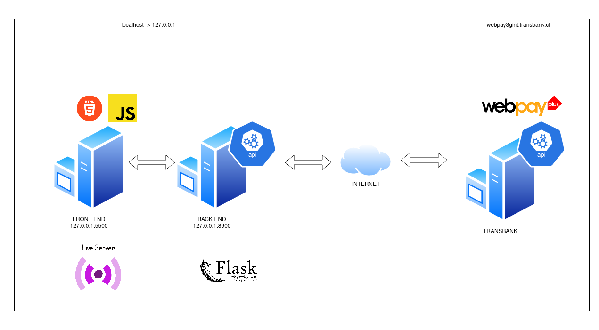

# INTEGRACIÓN TRANSBANK FRONTEND (HTML + JAVASCRIPT) Y BACKEND DE INTEGRACIÓN CON TRANSBANK (API REST FLASK)

Transbank no permite el llamado de su API REST directamente del navegador con Javascript desde el cliente. Si detecta esta acción el servicio retorna un error 401 y un bloqueo por CORS (Intercambio de recursos entre servidores).

Para consumir de forma correcta la API de Transbank es necesario el llamado desde un back-end o front-end pero del lado del servidor. Por este motivo se diseña integración dividiendo en front-end y back-end los componentes que se usarán para la integración.

Para la primera aplicación se hace uso de un servidor **Live Server** de **vscode** que permite desplegar aplicaciónes web (html + css + javascript) con un click y la segunda aplicación será una API REST en flask que estará encargada de llamar a la API REST de Transbank con la cual intercambiará información. En el siguiente diagrama de alto nivel simplificado se puede observar la integración.



Para desplegar ambas aplicaciones se deberán seguir los siguientes pasos (revisar las notas al final del README.md):

### COMIENZO DEL DESPLIEGUE

El primer paso es abrir el directorio del proyecto **transbank-integration** en vscode y una terminal.


### BACKEND -> API REST FLASK DESPLIEGUE EN LINUX. 

Para desplegar en linux o en windows deberemos crear un entorno virtual de python, instalar las librerias para posteriormente ejecutar el servidor.


### FRONTEND -> HTML + JAVASCRIPT DESPLIEGUE. 

Para desplegar en linux o en windows deberemos tener instalado el complemento de Live Server para vscode.


### EJECUCIÓN TRANSACCIÓN ÉXISTOSA. 

El siguiente es un ejemplo de una transacción éxitosa.


**TARJETA Y CREDENCIALES**
```
REDCOMPRA: 4051 8842 3993 7763

Rut: 11.111.111-1

Clave: 123
```

### EJECUCIÓN TRANSACCIÓN RECHAZADA. 

El siguiente es un ejemplo de un rechazo de la transacción.


**TARJETA Y CREDENCIALES**
```
REDCOMPRA: 4051 8842 3993 7763

Rut: 11.111.111-1

Clave: 123
```

**NOTA:**

    - Se debe tener instalado python 3.10 y pip.

    - Se debe tener instalado complemento de Live Server de vscode.

    - Documentación obtenida de https://www.transbankdevelopers.cl/referencia/webpay#confirmar-una-transaccion

    - Se considero del flujo solo el caso de éxito y fracaso dejando de lado las demás condiciones de bordes para la realización de la reversa de la transacción.
